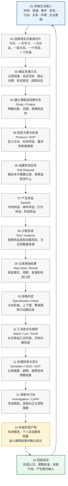
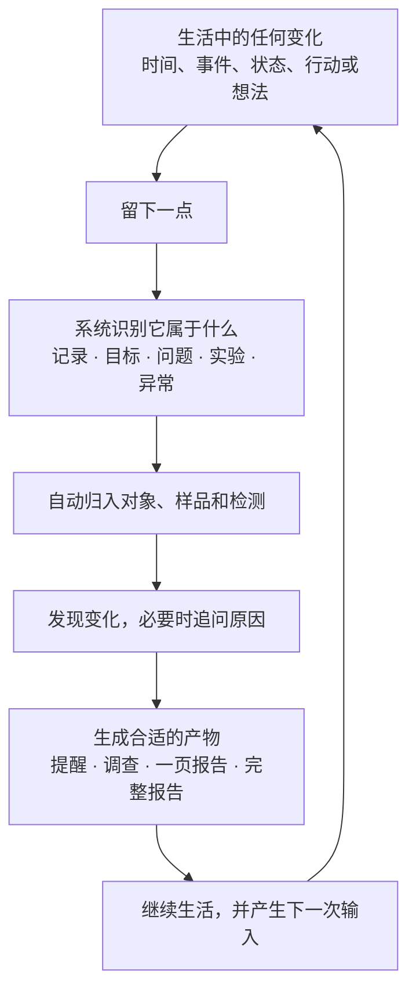
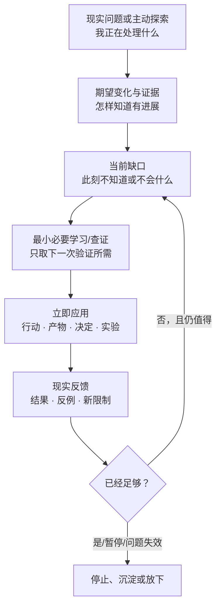
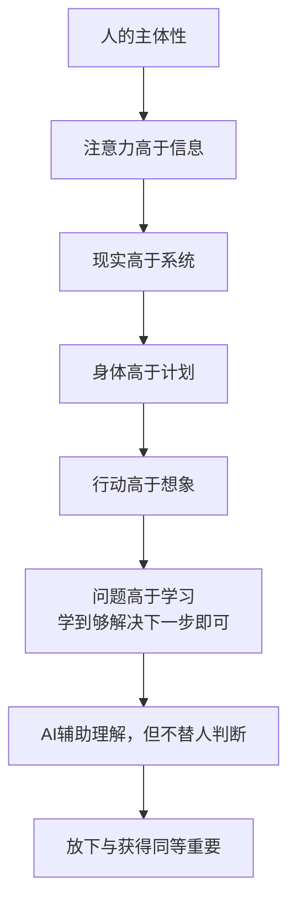

# Calmy 产品设计线性思维导图

> 本图根据 `Calmy_产品设计完整整理_2026-09-02.md` 生成。
> 2026-09-07 已加入“为解决问题而学习”裁决：学习是问题内部的按需手段，不是独立终点或自律指标。
> “提出问题”不是唯一入口；生活中的多个维度先进入系统，再按需要形成观察、检测、课题或报告。
> 总文档仍是唯一权威来源；本图只是线性总览。

## 一、生活输入不是单一入口

| 生活维度 | 进入系统的内容 | 可能形成的对象 |
|---|---|---|
| 时间 | 一天、一周、一个月、人生阶段 | 时间样品、批次、阶段 |
| 领域 | 身体、学习、工作、财务、关系、信息、家庭 | 领域模块、样品类型 |
| 事件 | 面试、对话、旅行、消费、冲突、作品、疾病 | 事件样品、记录、偏差 |
| 状态 | 异常、趋势、变化、困惑、疲惫、失衡 | 发现、调查、待观察事项 |
| 行动 | 任务、计划、决定、项目、输出 | 任务、项目、结果 |
| 关系 | 某个人、家庭、团队、共同记忆、共同决策 | 关系对象、共同空间 |
| 环境 | 工作环境、居住环境、互联网、工具和制度 | 环境样品、外部变量 |
| 主动意图 | 问题、目标、假设、想验证的判断 | 课题、实验、检测请求 |

这些入口不是互相排斥的。同一个现实对象可以同时具有时间、领域、事件、状态和关系属性。

## 二、现实系统主流程

## 三、用户实际看到的简化流程

## 四、问题驱动学习支路

学习不替代多维现实输入，也不是每条输入的必经步骤。只有问题暴露信息、方法或能力缺口时，才进入这条有限支路：

这条支路不使用学习时长、连续天数、课程完成量或自律评分作为默认成功指标。

## 五、入口与系统对象的关系

| 入口 | 首先进入的系统对象 | 后续可能进入的流程 |
|---|---|---|
| 一天或一个阶段 | Sample / Batch | 检测、趋势、报告 |
| 一次事件或行为 | Sample / Record | 检测、偏差、调查 |
| 一个领域或关系 | Object / Module | 任务、权限、长期追踪 |
| 一个异常或趋势 | Finding / Deviation | OOS、OOT、Investigation、CAPA |
| 一个目标或计划 | Project / Task | Protocol、Test、Result、Review |
| 一个问题或假设 | Study / Experiment | 变量、样品、分析、结论 |

## 六、流程中的核心原则

1. Calmy 的起点是现实输入，不是固定的“提问按钮”。
2. 先识别现实对象和观察切片，再决定采用记录、目标、问题、实验还是异常处理流程。
3. 样品可以按时间、事件、行为、环境、关系或阶段建立。
4. 不同入口最终可以汇入同一套可追溯结构：对象 → 样品 → 检测 → 结果 → 判定 → 趋势 → 行动 → 报告。
5. 报告不是每次输入都必须生成，只有达到阶段性价值时才形成。
6. 流程结束不是生活结束，而是回到现实并产生新的输入。
7. 学习只在真实问题出现当前缺口时进入流程，并在取得应用证据或达到停止条件后退出。

## 七、总纲约束

这部分不是另一条业务流程，而是所有流程都必须服从的上层原则。

