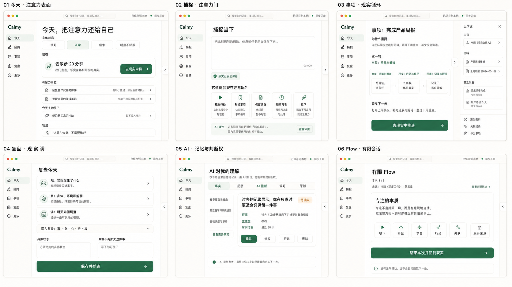

# Calmy 统一产品与体验设计

> 版本：2026-08-29 · 状态：产品与体验总设计（当前权威）
>
> 本文整合《身在网络，活在现实》、2026-08-22 产品/UI 重设计、Flow 产品边界、既有产品决策、领域模型、AI 行为规则和路线图。实现事实与剩余任务分别以实现总档案和 `OPEN_WORK.md` 为准。

## 设计图



V2 设计板统一呈现 Today 注意力表面、Capture 注意力门、Matter 现实循环、Review 观察调、AI 记忆与判断权、有限 Flow，并保留四入口、更多模块和可独立收起的双侧栏。

V2 是当前视觉设计参考；V1 作为上一版迭代稿保留在 `assets/`。两张图均用于表达产品与体验方向，不是当前实现截图，也不替代实现档案、测试结果或验收证据。

## 1. 产品命题

Calmy 是一套帮助人保护注意力、看见身体与现实，并把数字理解转回现实行动的个人系统。

它不是更大的任务管理器、知识仓库、健康仪表盘、AI 人生导师或数字化第二人生。它首先是一套 `Attention OS`：帮助用户判断什么值得进入注意力、现在是否需要处理、需要投入多少，以及何时可以结束和放下。

一句话承诺：

> Calmy 从你开始，帮助你看清此刻，把你送回现实，并在你带着真实经历回来时帮助理解、沉淀和放下。

英文表达保留为品牌辅助语，不替代中文产品说明：

> Calmy begins with you, sends you back to reality, and waits for you to return.

## 2. 产品宪法

以下原则高于页面、模块、增长指标和技术便利。任何新功能都必须逐条通过。

1. **注意力高于信息**：系统的首要职责是过滤，而不是收集更多。
2. **现实高于系统**：现实负责产生人生，数字系统只负责映照、准备和沉淀。
3. **身体高于计划**：计划应适应此刻身体，身体不是完成计划的耗材。
4. **行动高于想象**：AI 和数字工具可以推演，现实行动才提供答案。
5. **观察高于评判**：先区分事实、身体、情绪和解释，再决定如何行动。
6. **放下与获得同等重要**：暂停、跳过、归档、结束和不再记录都是正式能力。
7. **人高于 AI**：AI 是镜子、过滤器、参谋和执行助手，不是价值判断者。
8. **系统维护成本必须低于现实收益**：需要用户长期维护却不能改善现实的功能应被收缩或删除。

## 3. 稳定层级

Calmy 的概念层级统一如下：

```text
观：保留局外人的观察位置
  ↓
我：主体性的选择者
  ↓
注意力：当下可主动调度的生命资源
  ↓
现实 / 虚拟：现实发生，虚拟映照
  ↓
身体：人与现实之间的第一接口
  ↓
Matter：真正进入生命的重要事项
  ↓
Cycle / Stage：Matter 的过程模型
  ↓
Trajectory：时间中的真实变化
  ↓
AI 与数字工具：位于人的判断下游
```

五行不再解释整个产品，只作为 Cycle 中可选的过程语言。普通界面默认使用“这一轮、当前阶段、下一步、收束、沉淀”等自然语言。

## 4. 目标用户与不做对象

### 4.1 优先用户

- 正在面对持续数周以上的真实课题；
- 信息和计划很多，却常因压力、身体状态或不确定性失去下一步；
- 愿意每天用少量时间定向和复盘，但不愿维护复杂系统；
- 希望借助 AI，又不愿把判断权交给 AI；
- 需要允许停顿、回退、降载和重新开始的非评判系统。

### 4.2 不优先服务

- 团队项目管理、实时多人协作和绩效管理；
- 重度知识库、全量健康追踪或专业财务记账；
- 以连续打卡、完成数量、浏览时长和奖励刺激为核心的自律产品；
- 需要系统自动规划人生或替用户作最终决定的场景。

## 5. 统一生命微循环

新母本的 `观 → 察 → 择 → 注 → 行 → 受 → 化 → 放` 与既有 Reality 闭环合并为同一流程：

| 生命阶段 | 用户问题 | Calmy 职责 | 既有能力 |
|---|---|---|---|
| 观 | 此刻发生了什么 | 提供安静入口，不立即评价 | Today / Review |
| 察 | 事实、身体和环境怎样 | 轻量呈现身体与现实，不量化统治 | Capacity / Record |
| 择 | 什么值得我的生命 | 通过 Attention Gate 做选择 | Capture triage / Matter |
| 注 | 现在注意什么、多久 | 只保留 1 个主行动和最多 2 个次行动 | Today |
| 行 | 现实中做什么 | 给出出口并鼓励关闭 Calmy | Action |
| 受 | 现实返回了什么 | 接收成功、失败、损耗、意外和回退 | Record |
| 化 | 我如何理解它 | 区分事实、解释、AI 推断和用户判断 | Review / Insight / Seed |
| 放 | 什么可以离开注意力 | 暂停、结束、归档、再见或无需记录 | let_go / archive / Flow 再见 |

核心产品闭环继续保持：

```text
Capture 现实
  → Attention Gate
  → 判断是否进入 Matter / Action / Record / Seed，或直接放下
  → Today 选择 1–3 个可承受行动
  → 离开 Calmy，在现实中行动
  → Record 真实发生
  → Review 理解、调整或结束
```

## 6. 核心对象统一

新母本提出的 Self、Matter、Action、Experience、Memory、Trajectory 不建立第二套数据库，而与现有领域模型这样合并：

| 新母本概念 | 当前领域承载 | 裁决 |
|---|---|---|
| Self | 当前用户、Profile、Preference、Principle | 是观察与选择主体；MVP 不新增“数字人格”实体 |
| Matter | Matter | 保持现有聚合根，重新强调“值得占据注意力的现实事项” |
| Action | Action | 必须指向现实动作和退出系统，不是孤立 Todo |
| Experience | Record | 用户界面可称“发生/经历”，存储仍使用 Record，保留发生时间和修订 |
| Memory | Record / Reflection / Observation / Insight / Seed / Resource 的分层视图 | 不新建万能记忆库，不把 AI 推断混入事实 |
| Trajectory | 经 Record 证据支持、用户确认的 Trajectory | 允许推进、停滞、退步、绕路、失去和重启 |
| Body | Today/Record 的轻量状态字段 | 不建立 Health Dashboard，不做医疗判断 |
| Attention Decision | Capture 建议、Today 选择、let_go、Flow 反馈 | 先复用现有命令和状态；证明价值后再决定是否独立建模 |

现有 `Person → Matter → Cycle → Stage → Action → Record` 骨架继续有效。Person 是现实上下文，不是所有内容的强制入口；Cycle 是 Matter 的多轮过程；Stage 可以回退、跳转或重开。

## 7. 信息架构

### 7.1 一级导航保持四入口

| 入口 | 核心问题 | 主行动 |
|---|---|---|
| Today | 此刻什么值得我注意？ | 选择现实主行动并离开系统 |
| Capture | 现在先安全记下什么？ | 保存原文，整理延后 |
| Matters | 哪些事情真正进入了我的生命？ | 打开、暂停、推进或结束 Matter |
| Review | 现实返回了什么，我要如何调整或放下？ | 保存事实、理解和下一步 |

搜索、People、Library、Calendar、Flow、设置与同步继续放在“更多”或上下文入口。任务看板作为 Tasks 的辅助视图放在“更多”中，用于拖动 Action 在“待开始 / 进行中 / 已完成 / 已跳过 / 已取消”之间移动，不新增任务实体或第二套状态源。旧 Tasks、Goals、Habits、Finance、Pomo、Diary、Posts、Graph、场景等模块保留兼容路由，不升级为新的一级导航。

### 7.2 四边布局继续保留

- 左边：四个主导航，可收起和展开；只承载去哪里。
- 上边：当前位置、全局搜索、本地保存/同步状态；只承载现在在哪里和数据是否安全。
- 右边：当前 Matter、来源、人物、资料和最多三项上下文动作；默认可收起。
- 下边：移动端主导航或少量全局命令；不重复完整模块列表。

桌面双侧栏均可收起，右栏默认收起或按页面上下文出现。移动端使用底栏与 More 抽屉，所有关键触控目标至少 44×44px。

## 8. Today：从 Dashboard 变为 Attention Surface

Today 不再优先展示统计、模块和全部待办，而由三个区域组成。

### 8.1 现在

回答“我现在真正要去做什么”。只突出一个现实主行动，最多显示两个“有余力再做”。

```text
今天 · 身体：正常                  [搜索]

现在值得注意
[现实主行动]                       [去做]
因为：关联 Matter 的 why

有余力再做（最多 2 条）
今天主动放下
```

点击“去做”后的成功状态不是在系统中持续计时，而是明确提示“可以关闭 Calmy，去现实中做这件事”。计时、资料和 AI 只作为用户主动展开的辅助。

### 8.2 思考

回答“还有什么没有看清”。这里可以打开相关记录、资料、AI 建议或有限 Flow 专题，但默认折叠，不能抢占主行动。

AI 入口必须带当前问题、证据来源和退出动作，不能进入无上下文的长期聊天。

### 8.3 轨迹

回答“我最近正在经历什么”。默认使用叙事摘要和少量事实，不显示完成率、连续天数或单向增长曲线。

允许表达：正在推进、停滞、绕路、回退、失去、恢复或重新开始。所有判断都能回到 Record，并标明是用户确认还是 AI 候选。

## 9. Attention Gate

任何准备进入核心注意区域的内容，按以下四问经过判断：

1. 它值得我注意吗？
2. 它现在需要注意吗？
3. 它需要投入多久或多少承载？
4. 它需要现实行动、仅需知道、稍后再看，还是可以放下？

界面使用轻量动作，不要求填写完整表单：

| 动作 | 结果 |
|---|---|
| 现在行动 | 创建或关联 Action，可加入 Today |
| 形成 Matter | 仅在持续、多行动、需取舍或有复盘价值时建议 |
| 保留记录 | 保存为 Record，不制造待办 |
| 稍后再看 | 保存为 Seed 或资料，并保留来源 |
| 放下 | 不进入主列表，可保留最小审计或直接结束 |

Capture 必须先保存原文，再异步提供这些候选。AI 建议不能阻塞保存、改写原文或自动升级为 Matter。

## 10. 身体层

身体是人与现实之间的第一接口，但 Calmy 不成为健康量化系统。

### 10.1 最小状态

默认只提供可跳过的四级选择：

- 很好；
- 正常；
- 疲惫；
- 明显不舒服。

该状态用于调整 Today 的建议数量和语言，不用于评分、连续记录奖励、诊断或绩效比较。

### 10.2 产品规则

- 身体状态不会自动取消用户选择，只提示计划与事实的冲突；
- 疲惫时优先建议降低行动粒度、休息或只保留一件事；
- 明显不舒服时避免强化任务压力，并允许用户关闭所有建议；
- AI 不提供医疗诊断，必要时只建议寻求专业帮助；
- 用户不记录身体状态也能完成核心流程。

## 11. Capture、Matters 与 Review

### 11.1 Capture

唯一首要承诺是“原文已安全保存”。保存后可以不整理直接离开。

候选整理遵循 Attention Gate，支持接受、修改、拒绝和稍后处理。拒绝建议不删除原文；重复采纳不得创建重复实体。

### 11.2 Matters

Matter 不是 Todo 或目标，而是某个真正进入生命、值得占据一部分注意力的现实事项。它可以是工作、关系、学习、创作、困惑、选择或生命阶段。

列表只显示：为什么重要、当前状态、这一轮、下一步。详情保留 Action、Record、Cycle、人物、资料和 Flow 专题上下文。暂停、归档和结束都是合法状态。

### 11.3 Review

默认保持三步自然语言，避免表单膨胀：

1. 观：实际发生了什么？
2. 察：身体、环境和解释分别是什么？
3. 调：明天保留、降低、暂停、改变或放下什么？

需要更深反思时按需展开“事 / 身 / 心 / 行 / 放”：

- 事：可验证事实；
- 身：身体反应；
- 心：情绪、判断和解释；
- 行：现实下一步；
- 放：处理后不再继续占据注意力的内容。

提交前明确展示将更新哪些对象；任何 AI 生成的行动、Insight 或 Trajectory 必须由用户确认。

### 11.4 事项看板

事项看板是现有 Action 的可视化操作面，不替代 Today、任务列表或 Matter 详情。用户可以拖动卡片改变 Action 状态，也可以通过卡片内的状态选择完成键盘和触控操作；所有状态变更继续经过现有 Domain Command、revision、保存状态和同步审计。

看板使用五列：待开始、进行中、已完成、已跳过、已取消。完成、跳过和取消后的 Action 允许重新打开到待开始；从终止列直接移动到其他目标列时，系统先记录重新打开，再记录目标状态，避免绕过领域状态流转。看板默认提供全部、未结束、今天和事项筛选，空列明确提示可拖入，不以数量或完成率制造压力。

## 12. Cycle 与 Trajectory

### 12.1 Cycle

Cycle 只解释 Matter 如何演化：

| 阶段 | 自然语言 | 产品作用 |
|---|---|---|
| 木 | 生发 | 问题、愿望、方向或 Seed 出现 |
| 火 | 展开 | 行动、探索、试验和投入 |
| 土 | 承载 | 结果、身体、关系、资源和事实呈现 |
| 金 | 分辨 | 判断、舍弃、调整和收束 |
| 水 | 沉淀 | 经验进入记忆，事情归静并产生下一轮线索 |

顺序不是硬约束，用户可以暂停、回退、跳转、结束或重开。普通界面不要求理解五行术语。

### 12.2 Trajectory

Trajectory 不是成绩曲线，也不能只表示成长。它是基于一组 Record 的可推翻解释，默认由系统提出候选、用户确认或修改。

允许状态至少包含：推进、稳定、停滞、回退、绕路、失去、恢复、重启和未知。展示时优先解释证据与时间范围，不做人格标签。

## 13. AI 与记忆治理

### 13.1 AI 的正确位置

```text
现实提供事实
  → AI 帮助过滤、连接、解释和提出方案
  → 人判断是否接受
  → AI 帮助准备数字材料
  → 人进入现实行动
```

AI 可以是镜子、过滤器、解读者、参谋、数字执行者和记忆助手；不能成为最终价值判断者、心理/医疗诊断者或自动人生规划者。

### 13.2 记忆必须分层

| 记忆层 | 含义 | 写入规则 |
|---|---|---|
| Fact | 已发生的事实 | 来自 Record、导入或设备；可更正并保留版本 |
| Reflection | 用户自己的理解 | 用户主动写入或确认 |
| AI Inference | AI 推断 | 必须有证据、置信度、时间范围；不能自动升级为事实 |
| Preference | 稳定偏好 | 可查看、修改、删除；不把一次行为当偏好 |
| Principle | 用户主动确认的原则 | 只能由用户创建或确认，不由 AI 猜测 |

用户必须能够查看、修改、否认和删除 AI 对自己的理解。界面使用“过去的记录显示……”而不是“你就是……”，始终给用户变化的空间。

### 13.3 AI 持久化规则

- 所有建议标明事实、推断和已确认内容；
- 关键建议展示来源、置信度、影响对象和撤销方式；
- AI 不能静默改变 Matter 状态、Trajectory、Stage、Action 或删除 Record；
- 写入统一经过 Domain Command，并记录 actor、command ID、source IDs 和 before/after；
- 敏感字段按最小必要范围进入上下文，默认不发送整库。

## 14. Flow 的位置

Flow 继续作为二级“内容再生命系统”，现在统一归入 Attention Gate，而不是独立内容平台。

- 内容首先来自用户自己的 Matter、Record、Seed、资料和学习轨迹；
- 外部来源必须可追溯、可关闭、可退出；
- 漫游、学习、回响和专题都必须有范围和结束卡；
- 收下、再见、学会、行动、关联和展开来源继续保留；
- “行动”优先创建现实下一步并提示退出；
- 默认不无限滚动、不自动播放下一条、不使用红点、连续奖励和焦虑通知；
- 在线时长、浏览量和内容消费量不是成功指标。

Flow 不建立第二套内容、用户、推荐或同步事实源。Seed 仍是统一内容对象，Library 负责长期存储与检索，Flow 只负责有限再激活。

## 15. 视觉与交互系统

### 15.1 视觉气质

- 安静、清晰、留白，避免仪表盘密度和多色竞争；
- 使用中性背景与单一行动强调色；
- 卡片只承载可操作对象，不把每段说明装进卡片；
- 统计默认降级为叙事和证据；
- 深色或沉浸视觉只用于 Focus/专题，不以刺激延长停留；
- 动效只解释保存、展开、移动、撤销和结束，并遵守 `prefers-reduced-motion`。

### 15.2 通用交互

- 每页一个视觉主按钮；
- 保存状态先报告本地持久化，再单独报告同步；
- AI 内容统一标注“建议”，支持接受、修改、忽略和撤销；
- 错误说明发生了什么、数据是否安全、下一步做什么；
- 删除优先归档或可撤销，事实更正保留 revision；
- 所有弹层支持 Escape、焦点约束和关闭后的焦点恢复；
- 320px、200% 缩放、系统大字号、键盘和读屏不丢失主行动与退出入口。

### 15.3 文案

产品语言优先使用：现在、值得注意、去做、发生、这一轮、当前阶段、调整、放下、结束。Cycle、Stage、Trajectory、Seed 等术语只在帮助层或高级视图中解释。

文案不使用“你失败了、你应该、连续中断、完成率不足”等评判语气。推荐使用“记录显示、可能、候选、可以考虑、过去曾经”。

## 16. 数据与事实源边界

以下既有技术与领域裁决保持不变：

```text
IndexedDB durable snapshot / Repository = 当前本地权威边界
Domain Command = 业务写入入口
Record = 现实历史
Mutation Log = 系统对象变更历史
D1 = 同步镜像
Markdown / Obsidian = 可迁移外部工作区
localStorage = 兼容回退与轻量偏好
```

Reality Record 和 Domain Mutation 不得互相替代。同步、AI、页面和外部 Adapter 不能绕过领域校验静默写入。冲突必须展示来源、版本和差异；删除、覆盖和批量变更必须可理解、可恢复或经用户确认。

## 17. 成功指标与反指标

### 17.1 核心指标

- 首次价值时间：3 分钟内形成一个 Matter 和一条现实行动；
- Capture 原文安全保存的耗时与成功率；
- 7 天内至少两次 `Today → 现实行动 → Record → Review`；
- 主动降载、暂停、放下或重写下一步的比例；
- 用户能否说明为什么这件事值得注意；
- 数据离线恢复、导出和重新导入成功率；
- AI 建议的接受、修改、拒绝和撤销是否清晰可控。

### 17.2 反指标

- 不把系统内停留时间、打开次数、浏览量、完成数量和连续天数作为北极星；
- 不以记录更多、知识更多、任务更多证明价值；
- 不通过红点、焦虑提醒、惩罚颜色和连续奖励制造回访；
- AI 未确认写入和同步静默覆盖的容忍目标为 0。

## 18. 分阶段设计路线

### 阶段 A：语义与界面收敛

- 将 Today 继续收敛为“现在 / 思考 / 轨迹”的 Attention Surface；
- 保留四入口、双侧栏和现有模块兼容路由；
- 在 Today/Review 增加可跳过的身体状态和“放下”语义；
- Capture 整理动作统一经过 Attention Gate；
- 所有主行动都提供明确现实出口。

退出门槛：用户不用理解领域术语，也能在 10 秒内说出现在要做什么并离开系统。

### 阶段 B：AI 与记忆治理

- 实现 Fact / Reflection / AI Inference / Preference / Principle 的可见分层；
- 用户可查看、修改、否认和删除 AI 记忆；
- AI 建议统一带来源、置信度、确认和撤销；
- 并发命令和跨集合写入完成幂等与持久化边界。

退出门槛：AI 推断不能静默成为事实，重复确认不能产生重复实体。

### 阶段 C：Trajectory 与结束能力

- 从 Record 生成可解释的 Trajectory 候选；
- 支持回退、绕路、失去、恢复和重启；
- Matter/Cycle/Action 的结束、暂停、归档与恢复语义一致；
- Review 能明确“无需继续”和“放下”。

退出门槛：用户可以结束一个事项而不被系统视为失败，所有趋势均可回到证据。

### 阶段 D：受控 Flow

- 先完成 Seed、来源链路、有限批次与结束卡；
- 再开放 Focus 和四种模式；
- 最后根据试点证据加入可解释推荐；
- 不以 Flow 挤压 Today、Capture、Matters、Review。

退出门槛：每次 Flow 会话有明确目的、边界、来源和现实出口。

### 阶段 E：真实试点

- 8–12 位目标用户使用 2–4 周；
- 验证首次价值、现实闭环、放下能力、身体尊重、AI 判断权和数据信任；
- 试点期间不新增模块，只修阻断和高频认知问题。

## 19. 发布与设计停止线

### Go

- 四个核心页面可以连续完成现实闭环；
- 本地保存、同步状态、冲突和恢复均可理解；
- 用户可以不记录身体、不接受 AI、不进入 Flow 仍完成主路径；
- 手机、键盘、读屏、200% 和大字号检查通过；
- 首页不以统计、未完成数量或内容流争夺注意力；
- 现实行动、结束和退出始终可见。

### No-Go

- 新设计建立第二套 Matter、Experience、Memory、Flow 或同步事实源；
- AI 自动定义用户、自动规划人生或把推断写成事实；
- 身体状态变成健康评分、连续打卡或生产力指标；
- 用户为了维护系统投入的时间超过系统带来的现实收益；
- 默认无限浏览、自动播放、连续奖励或遮挡退出；
- 仅凭页面存在、自动化数量或视觉完成宣布产品完成。

## 20. 旧设计合并与冲突裁决

| 旧设计内容 | 合并结果 |
|---|---|
| Reality 闭环 | 保留，扩展为观察—选择—行动—接收—转化—放下 |
| 四个主入口 | 保留，不新增 Home、People、Library 或 Flow 一级入口 |
| Matter 聚合根 | 保留，重新强调注意力与现实意义 |
| Record / Observation / Insight 分层 | 保留，并扩展为五类记忆治理 |
| Cycle / 五行 | 保留为 Matter 过程模型，层级下降、默认自然语言 |
| Trajectory | 保留为可推翻、需证据与确认的解释层，不做增长曲线 |
| Today 承载量 | 保留，加入身体优先和可跳过原则 |
| let_go / 暂停 / 归档 | 提升为宪法级“放下能力” |
| Flow / Focus | 保留为二级 Attention Gate，不做内容平台 |
| 双侧栏与四边布局 | 保留，右栏默认收起或按上下文出现 |
| 旧功能模块 | 保留兼容和 More 入口，不进入新用户主路径 |
| AI 建议与确认 | 保留，进一步禁止 AI 推断自动升级为事实 |
| IndexedDB / D1 / Markdown 边界 | 保留，不因新理念新增存储事实源 |

## 21. 新功能判断清单

每个新功能在设计和开发前必须回答：

- 它保护还是消耗注意力？
- 它是否更快把用户送回现实？
- 它是否尊重身体事实和低承载状态？
- 它是否帮助用户判断，而不是替用户判断？
- 它是否允许跳过、关闭、结束和放下？
- 它是否把解释、AI 推断或历史偏好伪装成事实？
- 它是否复用现有实体、命令、保存和同步协议？
- 它的长期维护成本是否低于现实收益？

任一核心问题无法回答，应先留在实验或拒绝进入开发。

## 22. 文档维护规则

- 本文是产品定位、信息架构、核心体验、AI/记忆、Flow 和设计边界的统一入口。
- `PRODUCT_DECISIONS_2026-08-19.md` 继续追加具体 Accepted/Experiment 决策，不复制整篇设计。
- `OPEN_WORK.md` 只记录未完成实施与验收，不重复产品愿景。
- 旧产品重设计、UX、路线图、评审纪要和 2026-08-19 参考文档保留为来源与细节参考；与本文冲突时以本文和后续 Accepted 决策为准。
- 实现是否完成必须以代码和可复现验证为证据，不能由本文的设计状态推断。
