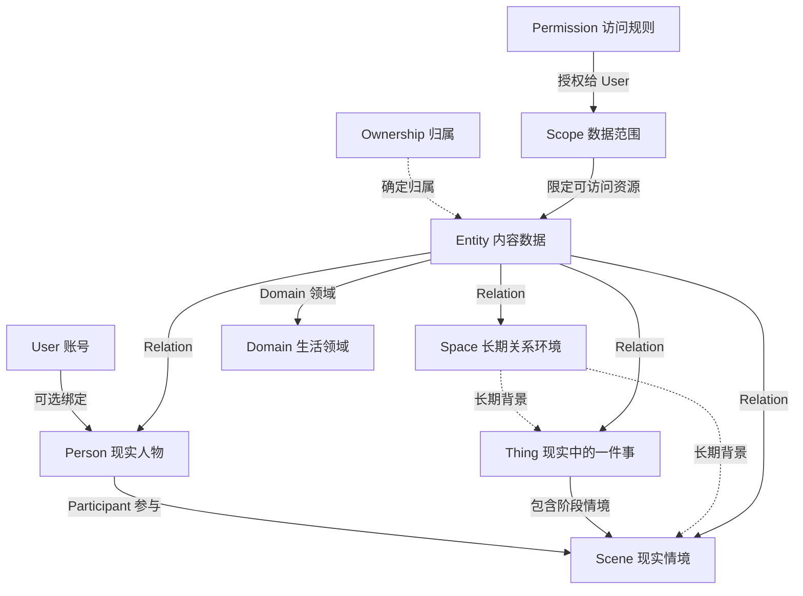

# Calmy 多人场景与现实数据模型设计

> 状态：设计草案，待评审
> 日期：2026-09-29
> 范围：核心对象关系与旧模型兼容边界；本文件不代表数据迁移或代码实现已经开始。

## 1. 目标与已确定方向

本设计把《Calmy 多人场景、模块关系与数据共享核心设计方案》确立为目标模型，同时保留既有数据、标识和运行能力的兼容路径。目标不是同时维护两套领域本体：新模型作为规范语义，旧模型通过兼容映射继续读写和迁移，直到对应迁移阶段验收。

已确定的方向：

- `Person`、`Scene`、`Space`、`Entity`、`Domain`、`Relation`、归属与权限、`Participant` / `Scope` 以新方案为主。
- `Thing` 融合新方案的现实事项语义与旧 `Matter` 已有数据及能力。
- 生命周期、历史、存储协议和既有数据需要兼容旧方案；兼容层不能反过来成为新的目标模型。
- 未注册账号的现实人物可以存在并参与现实情境，但不会因此自动获得数字访问权。
- 本阶段只确定对象与关系语义；数据库迁移、权限接入和 UI 改造另列实施计划。

## 2. 目标对象模型



对象职责与边界：

| 对象 | 规范职责 | 关键边界 |
|---|---|---|
| `User` | 登录、认证、设备与账号安全 | 数字身份，不代替现实人物 |
| `Person` | 表示现实人物并作为统一引用点 | 可以未绑定账号；“关于某人”不代表数据归该人所有 |
| `Thing` | 表示值得理解、选择、推进、处理或回看的现实对象 | 融合 `Matter`；不是任务集合，也不要求必须有 `Scene` 或 `Space` |
| `Scene` | 表示 Thing 在某阶段形成的具体现实情境 | 与 `Cycle` 分开；可关联多人和数据，也可不属于 Space |
| `Space` | 表示多人长期关系环境 | 组织共同生活背景，不自动授予成员数据权限 |
| `Entity` | 表示现实过程中产生、可独立引用和关联的数据 | 如 Action、Note、Record、File、Expense、HealthRecord、Asset、Memory |
| `Domain` | 表示 Entity 所属的生活领域 | 如 Health、Finance、Travel；与 Entity Type 分层 |
| `Relation` | 以稳定 ID 连接对象并表达明确语义 | 关系类型必须有定义和约束，不能任意生成同义词 |
| `Ownership` | 记录谁创建、拥有、描述或管理数据 | 创建者、所有者、主体、管理者互不推定相等 |
| `Participant` | 记录现实人物参与某个 Scene | 现实参与与系统账号访问分开 |
| `Scope` / `Permission` | 选择资源范围，并说明哪个账号可以做什么 | Scope 选数据；Permission 授权；Space 成员资格本身不是授权 |
| `View` | 为特定 User 按可访问数据形成呈现 | 不复制数据，也不改变归属和授权事实 |

## 3. Person 与账号绑定

`Person` 是现实人物的规范实体，沿用现有稳定 Person ID。`User` 是独立的账号身份。一个 Person 可以没有绑定 User；绑定关系由显式身份关联表达，不把邮箱、显示名或 Person ID 当作账号 ID。

`SceneParticipant` 关联现实 Person 与 Scene，并可记录参与角色、加入/离开时间等场景语义。若 Participant 对应 Person 尚未绑定 User，该 Person 只表达现实参与。数字访问需要已认证 User，并通过 Permission 获得相应授权。

旧 `Relationship` 中的双方人物 ID 与 `SharedSpace.memberIds` 继续作为兼容数据读取。兼容访问校验不得把 Person ID 和当前会话 User ID 静默视为同一种身份；迁移时需要显式解析绑定关系，无法解析时默认不扩大访问范围。

## 4. Thing 融合 Matter，Scene 独立表达情境

### 4.1 Thing / Matter 融合规则

规范语义使用 `Thing`。旧 `Matter` 是 Thing 的兼容来源，不创建一份平行 Thing 再复制 Matter 内容。

| 旧 Matter 字段或能力 | Thing 目标语义 | 兼容规则 |
|---|---|---|
| `calmyId` | Thing 稳定 ID | 原 ID 保留；路径、标题变化不改变身份 |
| `title`、`why`、`problem` | 名称、缘由与问题上下文 | 原值保留；空值不因迁移被补造 |
| `desiredChange`、`progressEvidence`、`currentGap`、`nextTest`、`stopCondition` | 期望、证据、缺口、下一验证和停止条件 | 作为 Thing 的上下文内容保留 |
| `status` | Thing 当前管理状态 | 可兼容读取现有 `draft / active / paused / archived`；转换由显式命令负责 |
| `trajectory`、`evidenceIds` | 趋势与依据 | 保持来源和可追溯性，不把推断改写成事实 |
| `currentCycleId`、`currentStage` | 旧过程迭代引用 | 继续指向 Cycle / Stage 兼容层，不改解释为 Scene |

每条旧 Matter 在规范视图中解析为一个 Thing；同一时刻只有一个权威对象。迁移阶段可由适配器读写旧格式，但不能双写出两个可独立编辑的 Matter 与 Thing。

### 4.2 Scene 与 Cycle 的边界

`Scene` 是现实经历形成的情境，例如“9 月住院治疗”或“第二次家庭旅行”。建议生命周期为 `Draft → Active ↔ Paused → Completed → Archived`；完成表示情境结束，归档只改变整理状态。`Cycle` / `Stage` 是旧系统中的过程迭代和阶段组织，服务于事项推进历史。它们可以指向同一个 Thing，但语义不同：

```text
Thing：爸爸住院
├── Scene：9 月住院治疗（现实情境）
└── Cycle：就医事项处理第 1 轮（旧流程迭代，可选兼容引用）
```

简单 Thing 可以没有显式 Scene；复杂、多成员或跨模块情境再创建 Scene。界面可把简单情况呈现为“一件事”，不要求用户先理解 Scene。

现有 `src/core/scenes.ts` 的静态个人/情侣/家庭配置属于界面呈现和模块可见性配置，不是 Scene 实例；不能迁移为现实情境记录。后续实现需给两者使用不冲突的命名边界。

Scene 建议具有稳定 ID、可选 `thingId`、可选 `spaceId`、参与 Person、时间范围、状态及关联 Entity。完成或归档 Scene 只结束该情境，不删除、复制或改写关联 Entity。

## 5. Space、Entity、Domain 与 Relation

### 5.1 Space

规范语义使用 `Space`，表示长期关系环境。现有 `SharedSpace` 可按稳定 ID 映射到 Space，其成员、关系、边界与 Thing/Matter 引用需要在迁移期保留来源。

Space 记录“处于什么共同关系背景”，不作为默认 ACL。规范生命周期至少区分 `Active / Closed / Archived`：关系结束可关闭 Space，但不删除内容；归档是整理状态。现有 `SharedSpace` 可按稳定 ID 映射到 Space，其成员、关系、边界与 Thing/Matter 引用需要在迁移期保留来源。关闭 Space 不删除其 Thing、Scene、Entity 或历史；成员关系结束后的访问变化由 Permission 规则确定。

### 5.2 Entity 与 Domain

现实对象和内容数据分层：

```text
现实对象：User / Person / Thing / Scene / Space
内容数据：Action / Note / Record / File / Expense / HealthRecord / Asset / Memory …
```

既有 Action、Record、Resource、Asset 等类型继续作为具名类型表达其自身字段；统一 Entity 语义负责可引用身份、版本、来源和通用归属关联，不以不透明 JSON 替代类型化字段。

Domain 是独立生活领域分类，例如 Health、Finance、Relationship、Work、Learning、Travel。一个 Entity 可关联一个或多个 Domain，也可同时关联多个现实对象，但数据实体本身保持一份。Domain 不与 Entity Type 混用；例如 CT 报告的类型可以是 File，领域是 Health。

### 5.3 Relation

Relation 使用 `(sourceType, sourceId, relationType, targetType, targetId)` 稳定表达对象连接。每种关系由 `RelationDefinition` 约束：允许的源/目标类型、方向、基数、反向语义及是否需要附带来源或时间。先收敛标准关系，再允许经审查扩展。

实体名称只用于显示，不作为关系主键。旧有 Matter ID、Person ID、SharedSpace ID 和 Core Entity ID 在兼容期间由类型化引用准确区分。

## 6. Ownership、Scope 与 Permission

每个内容 Entity 需要能够分别表达：

- `createdBy`：谁创建；
- `owner`：数据最终属于谁，可为 Person、User、Space 或之后明确定义的组织主体；
- `subject`：数据描述谁或什么；
- `steward`：谁负责维护。

字段可以相同，但不能互相推导。`关于爸爸的私人日记` 可以 subject 为爸爸、owner 为本人、privacy 为 Private。

`Scope` 选择可访问数据集合，例如 Person=爸爸 且 Domain=Health；`Permission` 授予指定 User `View / Comment / Edit / Manage` 能力。现实 Participant 身份、Space 成员资格和数据 Owner 都不能单独等同 Permission。

默认授权为拒绝。兼容策略按以下优先级解释：明确拒绝 > 明确授权 > 继承授权 > 默认拒绝；授权范围沿 `Entity > Scope > Scene > Space` 评估，实体级隐私限制可以收窄上层范围。共享共同 Scene 时允许公共 Entity 与私人 Entity 并存。旧 `allowedMatterIds / blockedMatterIds / matterIds` 在映射为 Scope / Permission 并验证之前，只能维持既有或更严格的有效访问范围，不得因迁移扩大可见数据。

权限评估需返回可解释的依据，例如授权来源、命中的 Scope、适用 Permission 或拒绝规则，而不只返回布尔值。

## 7. 生命周期、版本与历史兼容

Thing 与 Scene 使用不同生命周期。Thing 可跨越多个阶段情境；Scene 的完成表示现实情境结束。Scene 归档不删除关联内容；Thing 结束也不隐含删除 Entity。

每个对象保留稳定 ID、创建/更新时间、修改者、来源、版本或 revision。现实事实记录与对象修改历史分开：

- Reality Record 说明现实发生了什么；
- Domain Mutation / Activity 说明对象何时、由谁、基于什么发生变化。

现有 MatterMutation、CoreEntityMutation 与协作审计日志是历史兼容来源，迁移不能合并丢失、伪造统一时间线或覆盖原始来源。`Cycle`、`Stage`、Matter 状态与既有 Record 历史在明确转换规则前继续可读、可回滚。

分手、退出或关闭 Space 是关系与访问状态变化，不等于删除空间内数据。个人数据按其 Owner 保留；共同数据按显式归属与授权规则继续处理。

## 8. 存储、格式与迁移约束

- IndexedDB、现有 Repository、Open Format、备份恢复和同步契约继续作为现状边界；本设计不指定新的远程事实源。
- 任何新对象类型、类型化关系、归属字段或权限字段都需要单独制定格式版本、往返读写、旧数据映射、回滚和同步冲突规则。
- 保留现有稳定 ID；若某个旧对象无法无损映射，必须保留旧载荷并报告兼容状态，不能静默丢弃字段。
- 迁移先提供只读映射和一致性报告，再分阶段切换写入；切换前后不得出现两个权威副本。
- 旧字段、旧路由和旧类型名只在兼容边界继续存在；用户-facing 术语以新模型的自然语言为准。
- 本设计不批准更改 `format_version`、引入特定数据库表、账号邀请流程或完整 ACL 实现；这些需要在实施计划中另行拆解和验收。

## 9. 分阶段范围与验收标准

### 本设计阶段

- 明确 User / Person、Thing / Matter、Scene / Cycle、Space / SharedSpace 的语义边界。
- 定义 Entity、Domain、Relation、Ownership、Participant、Scope、Permission 的规范职责。
- 列出旧数据的稳定 ID 映射、必须保留的历史及不得自动扩权的规则。

### 后续实施计划需要覆盖

1. 纯读取映射与旧/新模型一致性审计；
2. Person—User 显式绑定及未绑定人物处理；
3. Thing/Matter 兼容 Repository 与状态转换；
4. Scene 和 Participant 的增量持久化；
5. Space 与 Scope/Permission 解耦；
6. RelationDefinition、Entity/Domain 的格式及同步兼容；
7. 历史、备份恢复、Open Format 与回滚验证；
8. 逐场景迁移和真实用户权限理解验证。

### 设计通过条件

- 任意现有 Matter 可用同一稳定 ID 表达为 Thing，旧数据无丢失且不产生双事实源。
- 旧 Cycle/Stage 能继续表达工作迭代，不被误认成现实 Scene。
- 现有界面 Scene 配置不被转换成现实事件数据。
- 未注册 Person 的参与记录不会生成账号或隐式访问权。
- Space、Participant、Owner、Scope 与 Permission 的语义彼此独立且可解释。
- 私人 Entity 可处于共同 Thing/Scene/Space 中，默认不会因上下文归属自动公开。
- 关闭 Scene 或 Space 不会导致 Entity 或其可追溯历史消失。
- 迁移可以逐步回滚，并保留既有 ID、版本、来源与历史。

## 10. 当前未纳入本设计的工作

- 具体 SQL / IndexedDB schema、API、页面和邀请流程；
- 完整共享 UI、链接分享及外部账号邀请；
- 自动权限继承的性能优化；
- 所有生活领域的详细 Entity 子类型定义；
- 旧文档中尚未被本次方向明确授权的其他产品改造。
